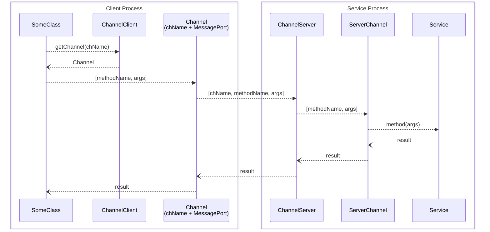

# Architecture of VS Code

VS Code consists of multiple processes that communicate with each other using inter-process communication (IPC). There is always exactly one main process, one shared process, and one PTY host process. In contrast, a new renderer process and its associated processes are created for each window. 

By adopting this architecture, VS Code can improve latency in the UI and take advantage of multi-core CPUs by offloading heavy tasks to multiple separate processes.

The user interface displayed in the main window is rendered from the `workbench.html` file.


## Creating processes

The main process creates the renderer process, search process, extension host, file watcher process, and PTY host process. MessagePorts are created and transferred to each process as needed. The steps involved in spawning a new process can vary in several ways; in some instances, other processes may request the main process to create them.

### Where actually spawned

- renderer 
  - [src/vs/platform/windows/electron-main/windowImpl.ts#L640](https://github.com/microsoft/vscode/blob/1f48d5756c8b17f17a9a3e2dda2aa0ad4e6b7ce3/src/vs/platform/windows/electron-main/windowImpl.ts#L640)
  - [src/vs/platform/windows/electron-main/windowImpl.ts#L1105](https://github.com/Microsoft/vscode/blob/1f48d5756c8b17f17a9a3e2dda2aa0ad4e6b7ce3/src/vs/platform/windows/electron-main/windowImpl.ts#L1105)
- extension host
  - [src/vs/platform/utilityProcess/electron-main/utilityProcess.ts#L249](https://github.com/Microsoft/vscode/blob/708b6aa379c2c9d12c65123c8934ca5a6a29046d/src/vs/platform/utilityProcess/electron-main/utilityProcess.ts#L249)
  - [src/vs/platform/extensions/electron-main/extensionHostStarter.ts#L107-L108](https://github.com/Microsoft/vscode/blob/708b6aa379c2c9d12c65123c8934ca5a6a29046d/src/vs/platform/extensions/electron-main/extensionHostStarter.ts#L107-L108)
- shared process
  - [src/vs/platform/sharedProcess/electron-main/sharedProcess.ts#L173](https://github.com/Microsoft/vscode/blob/708b6aa379c2c9d12c65123c8934ca5a6a29046d/src/vs/platform/sharedProcess/electron-main/sharedProcess.ts#L173)
- watcher
  - [src/vs/workbench/services/files/electron-sandbox/watcherClient.ts#L36](https://github.com/Microsoft/vscode/blob/708b6aa379c2c9d12c65123c8934ca5a6a29046d/src/vs/workbench/services/files/electron-sandbox/watcherClient.ts#L36)
- search
  - [src/vs/workbench/services/search/node/ripgrepTextSearchEngine.ts#L75](https://github.com/Microsoft/vscode/blob/ff48b17c8bac582dfa4deb088dd0bb88c3049d54/src/vs/workbench/services/search/node/ripgrepTextSearchEngine.ts#L75)
- pty
  - [src/vs/platform/terminal/electron-main/electronPtyHostStarter.ts#L58](https://github.com/Microsoft/vscode/blob/708b6aa379c2c9d12c65123c8934ca5a6a29046d/src/vs/platform/terminal/electron-main/electronPtyHostStarter.ts#L58)
- debugger
  - [src/vs/workbench/contrib/debug/node/debugAdapter.ts#L221](https://github.com/Microsoft/vscode/blob/31092ac1a0f9e68026cd0796f184fd3dfe978069/src/vs/workbench/contrib/debug/node/debugAdapter.ts#L221)

### How MessagePorts transfered

Using the Electron API's [utilityProcess.fork](https://www.electronjs.org/docs/latest/api/utility-process#utilityprocessforkmodulepath-args-options) to generate a process enables the transfer of MessagePort via the [postMessage](https://www.electronjs.org/docs/latest/api/utility-process#childpostmessagemessage-transfer) method. This allows the transfer of MessagePort from the main process to each process. By sending a unique string such as 'vscode:startExtensionHostMessagePortResult' with the MessagePort, each process can identify the MessagePort.

- [src/vs/platform/utilityProcess/electron-main/utilityProcess.ts#L427](https://github.com/Microsoft/vscode/blob/708b6aa379c2c9d12c65123c8934ca5a6a29046d/src/vs/platform/utilityProcess/electron-main/utilityProcess.ts#L427)

## Source code organization

The source code organization of VS Code is described in detail below:

- https://github.com/microsoft/vscode/wiki/Source-Code-Organization

The implementation of the editor part, located in `src/vs/editor/`, and the implementation of various features, located in `src/vs/workbench/`, make up the majority of the code.
In `src/vs/platform`, services that do not depend on either `editor` or `workbench` are located, such as sharedProcess.

| dir | lines (exclude tests) |  |
| --- | --- | --- |
| src/vs/base/ | 91579 |  |
| src/vs/code/ | 5143 | The main function of each process is defined. |
| src/vs/editor/ | 191646 | Renderer Process (the Monaco editor) |
| src/vs/platform/ | 112612 | Main Process, SharedProcess |
| src/vs/server/ | 4465 | VS Code Server |
| src/vs/workbench/ | 688938 | Renderer Process, ExtensionHost Process, File Watcher Process |

The following numbers are aggregated by recursively tracing the imports with a script, so they may not be accurate. It counts the same code multiple times and counts unused code as well. The code for the Extension Host Process accounts for about half of this number.

|     | total lines (approx) |
| --- | --- |
| Main Process | 98000 |
| Shared Process | 95000 |
| Renderer Process | 310000 |
| ExtensionHost Process | 240000 |

When `browser/` and `electron-sandbox/` are parallel as shown below, for that feature, the code from `browser/` runs in the browser, while the code from `electron-sandbox/` runs on the desktop. If only `browser/` exists, the code from `browser/` will run on the desktop as well.

```
src/vs/path/to/feature/browser
src/vs/path/to/feature/electron-sandbox
```

The "standalone" in `src/vs/editor/standalone` refers to the Monaco editor.

### `src/vs/workbench/` directory organization

- `src/vs/workbench/api/`
  - ExtensionHost
- `src/vs/workbench/contrib/`
  - They provides contributions. Here, a contribution refers to non-persistent objects and the functionalities they offer. The life-cycle is associated with specific objects, and depending on the associated target, it is referred to as WorkbenchContribution, EditorContribution, and so on. 
- `src/vs/workbench/services/`
  - They provide services. Here, a service refers to persistent objects and the functionalities they offer. Persistent objects are those that continue to exist until the application is terminated.

Contributions and services are very similar, but the difference lies in whether the life-cycle is associated with specific objects or is persistent. Contributions are instantiated together with their associated objects and held by those objects. Services are held by the `instantiationService` after being created. In both cases, the `instantiationService` handles the creation.

Notice that  Contributions may be exceptionally defined in `workbench/services/`, and similarly, services may be defined in `workbench/contrib/`.

src/vs/platform/registry/common/platform.ts

## Dependency Injection and TypeScript decorators

Dependency Injection (DI) with [TypeScript decorators](https://www.typescriptlang.org/docs/handbook/decorators.html) is widely used in the source code of VS Code. It is explained in detail below:

- https://github.com/microsoft/vscode/wiki/Source-Code-Organization#dependency-injection

One of the purposes of using DI is to create services in the correct order. When services depend on each other, it is necessary to generate objects providing those services in the appropriate order.
The creation of objects is handled by the [InstantiationService](https://github.com/Microsoft/vscode/blob/a5f52063e4622bc318d9c550a682dc5b35ef7f33/src/vs/platform/instantiation/common/instantiationService.ts#L28) class. Each process has a unique `InstantiationService` object, which is created at the very beginning of the startup of each process. See an [example](https://github.com/Microsoft/vscode/blob/8cfb2b0e6c8dd80523711236d89dbead0338420b/src/vs/workbench/browser/workbench.ts#L196) of Renderer Process.

The following is the typical example of consuming a service:
```ts
export class SomeClass extends Disposable {
  constructor(
    private readonly arg: ArgTypeA,
    @IContextKeyService private _contextKeyService: IContextKeyService,
    @IInstantiationService private _instantiationService: IInstantiationService,
  ) {
```

`@IContextKeyService` is a decorator intentionally defined to share the same identifier as the `IContextKeyService` interface for convenience. See an [example](https://github.com/Microsoft/vscode/blob/7d2f5bb1aee0ce20c6259d96b0d81f0aa9f9a0db/src/vs/platform/contextkey/common/contextkey.ts#L2035-L2036).

When creating an object of `SomeClass`, the `createInstance` method is used:
```ts
instantiationService.createInstance(SomeClass, arg)
```

When the `createInstance` method is called, it generates objects such as the `IContextKeyService` object required by the constructor of the `SomeClass` class, if necessary. Usually, these objects are already created and held. The `createInstance` method adds the `IContextKeyService` object and others as arguments to call the constructor of `SomeClass`. The above decorator informs the `instantiationService` about the additional objects required for the constructor.

When you want to create an object within a method of `SomeClass`, you call `this._instantiationService.createInstance`.

The `registerSingleton` method is used to register the identifier and implementation class with the `instantiationService`.
The `registerSingleton` method stores these in a module scope variable. 
This method must be called when the modules are loaded and before the `instantiationService` object is created. See an [example](https://github.com/Microsoft/vscode/blob/74a3f54c07603e67e5eba6a561f8048f269fade8/src/vs/workbench/workbench.common.main.ts#L169-L170).

```ts
registerSingleton(IContextKeyService, ContextKeyService, InstantiationType.Delayed);
```

Besides using the `registerSingleton` method, a collection of services can be generated together when the `instantiationService` object is created.
See an [example](https://github.com/Microsoft/vscode/blob/c588828980a0a8abad76f87a73a2819a27be1b8c/src/vs/code/electron-utility/sharedProcess/sharedProcessMain.ts#L351).

## RPC (Remote Procedure Call)

VS Code uses RPC for communication between its internal processes. Any process can act as an RPC client and can also serve as a server; typically, the main process and the shared process operate as servers. TypeScript types shared between the client and server process are directly used as the RPC interface definition. There is no dynamic service discovery in this system. The channel names (service identifiers) are hardcoded in the source code.

To call a method on a service in another process, you first obtain a `Channel` for a service using its channel name. A Channel is a combination of the service's identifier, known as the channel name (`channelName`), and the MessagePort. Next, you invoke the `channel.call` method, which packages the channel name, the method name, and the arguments into an array: `[channelName, methodName, args]`. This array is then sent over the MessagePort using `postMessage`.

### Request Routing

On the service process side, a ChannelServer listens for incoming messages on the MessagePort. When it receives a message, it looks at the `channelName` to determine which service should handle the request. The ChannelServer then forwards the request to the appropriate ServerChannel, which is directly associated with a specific service implementation.

- `ServerChannel`: Each ServerChannel is mapped one-to-one with a service. It knows how to invoke the correct method on the service with the provided arguments.
- [`ChannelServer`](https://github.com/Microsoft/vscode/blob/2984f68510d7786386c43c992ef0c5d794493837/src/vs/base/parts/ipc/common/ipc.ts#L330): Maintains a mapping from channel names (channelName) to ServerChannels, allowing it to route requests to the correct service.

### Sequence Example

Here’s how a typical RPC call flows:

1. A Channel for a service is set up using its channel name.
2. A method is invoked on the Channel, which sends `[channelName, methodName, args]` over the MessagePort.
3. The ChannelServer in the service process receives the message, looks up the ServerChannel for chName, and forwards the call.
4. The ServerChannel invokes the requested method on the actual service.
5. The result is sent back through the same path to the client.



### Links

- fromService https://github.com/Microsoft/vscode/blob/2984f68510d7786386c43c992ef0c5d794493837/src/vs/base/parts/ipc/common/ipc.ts#L1110
- toService https://github.com/Microsoft/vscode/blob/2984f68510d7786386c43c992ef0c5d794493837/src/vs/base/parts/ipc/common/ipc.ts#L1188


## Links

- https://code.visualstudio.com/blogs/2022/11/28/vscode-sandbox
- https://code.visualstudio.com/blogs/2022/11/28/vscode-sandbox#_moving-processes-out-of-the-renderer
