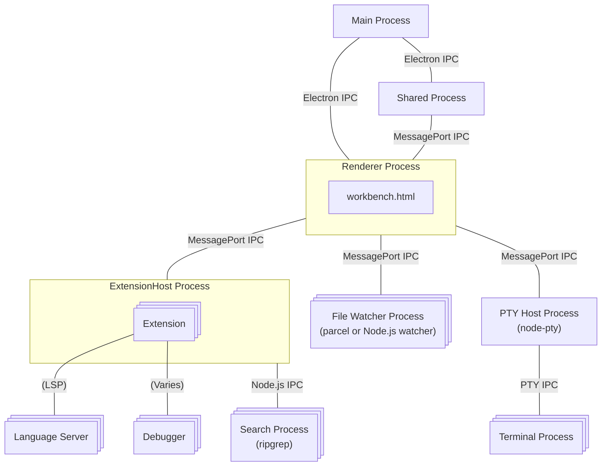

# Architecture of VS Code

## Creating processes

The main process creates the renderer process, search process, extension host, file watcher process, and PTY host process. MessagePorts are created and transferred to each process as needed. The steps involved in spawning a new process can vary in several ways; in some instances, other processes may request the main process to create them.

### Where actually spawned

- renderer 
  - [src/vs/platform/windows/electron-main/windowImpl.ts#L640](https://github.com/microsoft/vscode/blob/1f48d5756c8b17f17a9a3e2dda2aa0ad4e6b7ce3/src/vs/platform/windows/electron-main/windowImpl.ts#L640)
  - [src/vs/platform/windows/electron-main/windowImpl.ts#L1105](https://github.com/Microsoft/vscode/blob/1f48d5756c8b17f17a9a3e2dda2aa0ad4e6b7ce3/src/vs/platform/windows/electron-main/windowImpl.ts#L1105)
- extension host
  - [src/vs/platform/utilityProcess/electron-main/utilityProcess.ts#L249](https://github.com/Microsoft/vscode/blob/708b6aa379c2c9d12c65123c8934ca5a6a29046d/src/vs/platform/utilityProcess/electron-main/utilityProcess.ts#L249)
  - [src/vs/platform/extensions/electron-main/extensionHostStarter.ts#L107-L108](https://github.com/Microsoft/vscode/blob/708b6aa379c2c9d12c65123c8934ca5a6a29046d/src/vs/platform/extensions/electron-main/extensionHostStarter.ts#L107-L108)
- shared process
  - [src/vs/platform/sharedProcess/electron-main/sharedProcess.ts#L173](https://github.com/Microsoft/vscode/blob/708b6aa379c2c9d12c65123c8934ca5a6a29046d/src/vs/platform/sharedProcess/electron-main/sharedProcess.ts#L173)
- watcher
  - [src/vs/workbench/services/files/electron-sandbox/watcherClient.ts#L36](https://github.com/Microsoft/vscode/blob/708b6aa379c2c9d12c65123c8934ca5a6a29046d/src/vs/workbench/services/files/electron-sandbox/watcherClient.ts#L36)
- search
  - [src/vs/workbench/services/search/node/ripgrepTextSearchEngine.ts#L75](https://github.com/Microsoft/vscode/blob/ff48b17c8bac582dfa4deb088dd0bb88c3049d54/src/vs/workbench/services/search/node/ripgrepTextSearchEngine.ts#L75)
- pty
  - [src/vs/platform/terminal/electron-main/electronPtyHostStarter.ts#L58](https://github.com/Microsoft/vscode/blob/708b6aa379c2c9d12c65123c8934ca5a6a29046d/src/vs/platform/terminal/electron-main/electronPtyHostStarter.ts#L58)
- debugger
  - [src/vs/workbench/contrib/debug/node/debugAdapter.ts#L221](https://github.com/Microsoft/vscode/blob/31092ac1a0f9e68026cd0796f184fd3dfe978069/src/vs/workbench/contrib/debug/node/debugAdapter.ts#L221)

### How MessagePorts transfered

Using the Electron API's [utilityProcess.fork](https://www.electronjs.org/docs/latest/api/utility-process#utilityprocessforkmodulepath-args-options) to generate a process allows you to transfer a MessagePort via the [postMessage](https://www.electronjs.org/docs/latest/api/utility-process#childpostmessagemessage-transfer) method. This enables the transfer of MessagePort from the main process to each process. By sending a unique string such as 'vscode:startExtensionHostMessagePortResult' with the MessagePort, each process can identify the MessagePort.

- [src/vs/platform/utilityProcess/electron-main/utilityProcess.ts#L427](https://github.com/Microsoft/vscode/blob/708b6aa379c2c9d12c65123c8934ca5a6a29046d/src/vs/platform/utilityProcess/electron-main/utilityProcess.ts#L427)

## Source Code Organization

The source code organization of VS Code is described in detail below:

- https://github.com/microsoft/vscode/wiki/Source-Code-Organization

The implementation of the editor part, located in `src/vs/editor/`, and the implementation of various features, located in `src/vs/workbench/`, make up the majority of the code.
In `src/vs/platform`, services that do not depend on either `editor` or `workbench` are located, such as sharedProcess.

| dir | lines (exclude tests) |
| --- | --- |
| src/vs/base/ | 91579 |
| src/vs/code/ | 5143 |
| src/vs/editor/ | 191646 |
| src/vs/platform/ | 112612 |
| src/vs/server/ | 4465 | 
| src/vs/workbench/ | 688938 |

- workbench/, electron-sandbox/ = renderer process

workbench で node のときはだいたい extension host で実行される. その場合 extension host のその機能は
workbench (renderer) から呼び出せるようになっている.

## Links

- https://code.visualstudio.com/blogs/2022/11/28/vscode-sandbox
- https://code.visualstudio.com/blogs/2022/11/28/vscode-sandbox#_moving-processes-out-of-the-renderer
